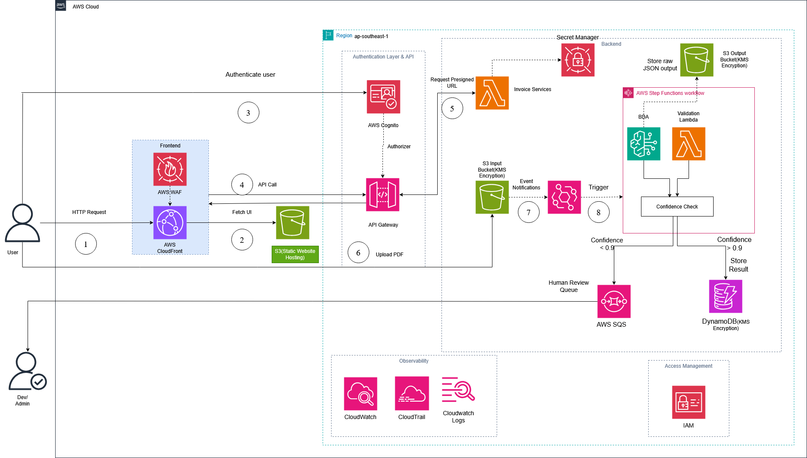

# Automated Invoice Digitization with Amazon Bedrock Data Automation and AWS

# Building a serverless, event-driven pipeline to transform paper and PDF invoices into structured data, ready for accounting and ERP system integration.

# The Challenge: Paper Invoices are Still a Bottleneck

Even with the push for electronic invoicing, many businesses especially in supply chain, retail, and construction still deal with a massive volume of paper invoices, scanned PDFs, or mobile photos. Accounting teams are forced to manually enter data: tax IDs, issue dates, total amounts, and line items. This repetitive work is prone to human error and cannot scale.

The challenge is clear: how do we extract structured information from unstructured invoices at scale, without building custom ML models or hard-coding parsers for every different invoice layout?

# Solution Overview

The proposed architecture utilizes a serverless pipeline orchestrated by AWS Step Functions no servers to manage, no polling, and no cron jobs. Each uploaded invoice automatically triggers a complete, end-to-end processing workflow.

AWS Services Used

Amazon Cognito (User Authentication)

CloudFront (CDN for Frontend)

AWS WAF (Web Application Firewall for CloudFront & API Gateway)

AWS IAM (Identity & Access Management)

S3 Static Website (Frontend Hosting)

API Gateway (API entry point)

AWS Lambda (URL generation and Validation logic)

Amazon EventBridge (Event routing from S3)

AWS Step Functions (Workflow Orchestration)

Amazon Bedrock Data Automation (AI-powered data extraction)

Amazon S3 (Storage for input PDFs, output JSONs, and error files)

DynamoDB (Database for structured results)

Amazon SQS (Queue for manual human review)

CloudWatch & CloudWatch Logs (Monitoring and logging)

Amazon SNS (Notifications)

## Detailed Architecture

The pipeline is built across three phases, each serving as a foundation for the next.

Phase 1: Resources Creation

Resources are created manually via the console: S3 buckets (input, output, error), Lambda functions, Step Functions State Machine, IAM roles with least-privilege permissions, KMS keys, CloudWatch log groups, and the destination data store.

Phase 2: Step Functions Orchestration & Data Processing

This is the heart of the architecture. The upload process is secured, and the processing logic is tightly managed by Step Functions:

Step 1.Authentication & Upload URL Generation: Users (or partner systems) authenticate via Amazon Cognito. They call API Gateway to request an S3 Presigned URL. An AWS Lambda function generates and returns this temporary URL, allowing the client application to upload the PDF securely and directly to the S3 Input Bucket, bypassing API Gateway's payload size limits.

Step 2.Workflow Trigger: Once the PDF is successfully uploaded to S3, an S3 Event Notification is sent to Amazon EventBridge. EventBridge immediately triggers the AWS Step Functions State Machine.

Step 3.AI Extraction: The first state in Step Functions invokes the Amazon Bedrock Data Automation  API using a predefined blueprint. BDA natively understands document structures. It extracts fields such as Vendor Name, Tax ID, Invoice Number, Issue Date, Line Items, and Total Amount. Each field comes with a confidence score. No API keys are needed; the system connects internally using secure IAM roles.

Step 4.Raw JSON Storage: Step Functions waits for BDA to finish and writes the raw JSON result into the S3 Output Bucket. This step is critical for auditing and maintaining data lineage.

Step 5.Validation and Normalization: Step Functions invokes the Invoice Processor Lambda. This function reads the JSON from S3, normalizes formats (dates, currencies), and evaluates the overall confidence score.

Step 6.Branching (Choice State) & Storage: Based on the confidence score calculated by Lambda, Step Functions branches out:

High Confidence (>= 0.9): Writes the structured data directly into DynamoDB.

Low Confidence (< 0.9): Pushes a message containing the data to an Amazon SQS (Human Review Queue) for an accountant to verify manually.

Invalid/Corrupted File: Moves the original file to an S3 Error/Quarantine Bucket.

Phase 3: Querying and Analytics

Once the data is stored in DynamoDB, it is immediately queryable via APIs or internal dashboards. Typical queries include: filtering by vendor, aggregating monthly VAT, checking for unreconciled invoices, and detecting duplicate invoice numbers.

# How the Services Connect

Understanding how these services communicate is key to customizing and extending this architecture.

## Step Functions as the Orchestrator

Instead of having Lambda functions call each other (which becomes difficult to debug), Step Functions provides a visual interface displaying the complete lifecycle of an invoice. You can look at the AWS Console and know exactly where an invoice is stuck (waiting for AI processing, or routed to the SQS queue due to low clarity). Step Functions also natively supports error handling (try/catch) and automatic retries for external API calls.

## S3 Presigned URLs and Edge Protection

Using Presigned URLs is an AWS Best Practice for handling large file uploads. It completely offloads the heavy lifting from the Backend layer (API Gateway/Lambda). Additionally,AWS WAF is attached directly to CloudFront (protecting the frontend) and API Gateway (blocking unauthorized URL requests, DDoS attacks, and SQL injection).

# Bedrock Data Automation as the Intelligence Layer

BDA is the reason this architecture doesn't require a custom ML model. When Step Functions triggers the extraction job, BDA retrieves the PDF from S3 and applies the invoice blueprint a JSON schema defining the required fields. The service understands document structure dynamically without needing rigid templates or training data.

Sample actual output:

{
    *vendor*: {
    *name*: ***ABC** Technology Co., Ltd*,
    *tax_id*: *0123456789*,
    *confidence*: 0.97
    },
    *invoice_number*: ***INV**-**2025**-**00431***,
    *total_amount*: **5500000**,
    *line_items*: [
    {
    *description*: *Software Consulting Services*,
    *quantity*: 10,
    *unit_price*: **500000**,
    *total*: **5000000**,
    *confidence*: 0.94
    }
    ]
}

## IAM as the Security Glue

All communications are executed via IAM roles with least-privilege permissions. There are no hardcoded credentials or API keys. Step Functions only has permission to call bedrock:InvokeDataAutomationAsync and invoke specific Lambdas. The Validation Lambda only has permission to PutItem into the Invoices DynamoDB table.

# Security and Compliance

Invoices contain sensitive financial information. This architecture integrates security layers by design:

Encryption at rest: AWS KMS encrypts all data stored in S3 and DynamoDB using customer-managed keys.

Encryption in transit: All service-to-service communication occurs over TLS 1.2+. No sensitive traffic passes unsecured over the public internet.

Edge Protection: AWS WAF blocks malicious traffic right at the network edge (CloudFront/API Gateway).

Audit trail: AWS CloudTrail logs all internal API calls. The S3 Output Bucket acts as an immutable black box, storing the raw AI extraction results for legal cross-referencing if required.

# Extending the Architecture

Once the core pipeline is stable, several expansions are possible:

ERP / Accounting Integration: The processor Lambda can call APIs of systems like SAP, Odoo, or MISA instead of merely saving to DynamoDB.

Dedicated Review Workflow: Build an internal web portal (React/Vue) for accountants. This portal pulls messages from the SQS queue, allowing staff to review and approve invoices flagged with a low confidence score.

Anomaly Detection: Add an extra task in the Step Functions workflow to query DynamoDB and compare the incoming invoice against historical data—flagging duplicate invoice numbers before they are saved.

# Conclusion

This Serverless architecture, orchestrated by Step Functions, solves the invoice digitization challenge in the most comprehensive, robust, and professional way:

Optimized Data Flow (S3 Presigned URLs): Completely resolves the file upload bottleneck typical in traditional API architectures.

Powerful Orchestration (Step Functions): Transforms the process from a loose chain of events into a highly observable state machine with smart branching, visual tracking, and superior error handling.

No Custom ML Required (Bedrock): Reduces deployment time from months (data collection, OCR model training) to days by leveraging AWS's out-of-the-box Generative AI capabilities.

The core takeaway: When invoices are no longer locked inside PDFs or desk drawers, but become structured data within the system, the entire organization gains the ability to make automated, data-driven decisions at an unlimited scale.