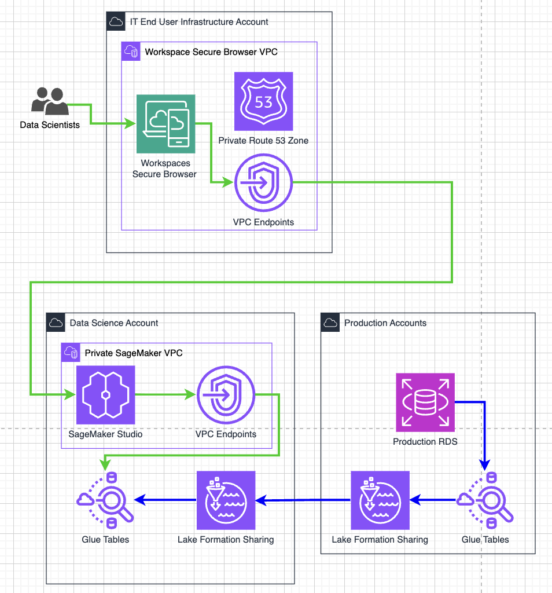

# Preventing Data Exfiltration in Machine Learning Environments with Amazon SageMaker AI

As organizations increasingly adopt Machine Learning (ML) to process sensitive information, protecting data from unauthorized access and exfiltration has become just as important as building accurate models.
Financial records, healthcare data, customer information, and proprietary datasets are valuable assets that require strict security controls throughout the ML lifecycle.

This article explores how a fictional fintech company, iBusiness, uses Amazon SageMaker AI, Amazon WorkSpaces Secure Browser, and AWS networking services to create a secure Machine Learning environment that minimizes the risk of data exfiltration while maintaining a productive experience for data scientists.

# The Challenge

Traditionally, organizations handling sensitive data relied on isolated, air-gapped environments or virtual desktop infrastructure (VDI) to protect confidential information.
While these approaches provide strong security, they also introduce several operational challenges:
High infrastructure and maintenance costs.
Time-consuming environment provisioning.
Difficult software updates and patch management.
Limited scalability as data science teams grow.
Reduced flexibility for remote work.

To modernize its ML platform, iBusiness adopted Amazon SageMaker Studio, AWS's fully managed development environment for Machine Learning. SageMaker Studio simplifies infrastructure management and integrates seamlessly with services such as AWS Lake Formation and Amazon Athena, allowing data scientists to focus on model development instead of managing compute resources.
However, moving to a managed cloud environment also required new mechanisms to prevent sensitive data from leaving the organization's AWS environment.

# A Three-Layer Security Architecture

To reduce the risk of data exfiltration, iBusiness implemented a defense-in-depth strategy consisting of three security layers:

   Secure user access through Amazon WorkSpaces Secure Browser.
   Restrict browser capabilities and prevent access to external AWS accounts.
   Isolate Amazon SageMaker AI from the public internet.

Each layer addresses different attack vectors, ensuring that multiple safeguards remain in place even if one control is bypassed.

# Layer 1 – Secure Access with Amazon WorkSpaces Secure Browser

Instead of providing every employee with a complete virtual desktop, iBusiness uses Amazon WorkSpaces Secure Browser, a managed Chromium-based browser hosted by AWS.
Users access SageMaker Studio exclusively through this secure browser, which operates inside a dedicated Virtual Private Cloud (VPC).
AWS Identity and Access Management (IAM) policies ensure that requests are accepted only from trusted Secure Browser sessions or approved network addresses.
To minimize opportunities for data leakage, Secure Browser is configured to:

Disable file downloads.
Block file uploads.
Disable copy-and-paste functionality.
Prevent document printing.

These restrictions allow data scientists to work normally while significantly reducing the possibility of transferring sensitive information to personal devices.

# Layer 2 – Restrict Browser Activities

After controlling how users access the environment, iBusiness limits what users can do once they are connected.
Allow Access Only to Approved Domains
Secure Browser enforces an allow list of approved URLs.
Users are permitted to access only:
AWS service domains
Amazon SageMaker AI resources

Popular external services such as email platforms, cloud storage providers, and file-sharing websites are blocked, preventing users from uploading confidential information outside the organization.

Prevent Access to Other AWS Accounts

Another potential risk is that users could sign in to a different AWS account and copy data into resources they control.

To prevent this, iBusiness deploys:

VPC Endpoints for the AWS Management Console
VPC Endpoints for AWS IAM Identity Center

Traffic remains entirely within the AWS private network instead of traversing the public internet.

Additionally, Amazon Route 53 Private Hosted Zones redirect AWS console traffic to private VPC endpoints, while Amazon Route 53 Resolver DNS Firewall allows DNS resolution only for approved AWS domains.

IAM policies further strengthen security by:

Allowing requests only through authorized VPC Endpoints.
Denying access to AWS resources outside the organization's approved accounts, except for designated administrative accounts.

Together, these controls make it extremely difficult for users to transfer data into another AWS environment.

# Layer 3 – Isolate Amazon SageMaker AI

The final security layer focuses on protecting the SageMaker environment itself.
Although SageMaker Studio provides terminals and integrated development environments for ML development, unrestricted internet connectivity could allow users to transmit sensitive information outside the organization.
To eliminate this possibility, iBusiness configures SageMaker with:

No Internet Gateway.
No NAT Gateway.
Private VPC Endpoints only for required AWS services.

This architecture enables SageMaker to communicate with essential AWS services while preventing any direct outbound internet access.
Endpoint policies further restrict access so that SageMaker can interact only with resources owned by the organization. For example, Amazon S3 write permissions are limited exclusively to approved company-managed buckets.

Results

  By implementing this architecture, iBusiness achieved several measurable improvements:
  Infrastructure costs decreased by approximately 80%, reducing monthly per-user expenses from over $40 to roughly $7 through the adoption of Amazon WorkSpaces Secure Browser instead of traditional VDI.
  Environment provisioning time was reduced from approximately two days to only a few minutes.
  Operational overhead for maintaining individual desktop environments was significantly reduced.

# Conclusion
Securing Machine Learning workloads requires more than authentication and authorization. Organizations must also control how data moves throughout the entire development environment.
The architecture presented by AWS demonstrates how Amazon WorkSpaces Secure Browser, Amazon SageMaker AI, Amazon VPC Endpoints, Amazon Route 53 Resolver DNS Firewall, and AWS IAM can work together to reduce the risk of data exfiltration without compromising developer productivity.
Rather than relying on expensive isolated desktop environments, this layered approach provides a scalable, cloud-native solution for organizations that build and train Machine Learning models on AWS while handling highly sensitive data.

Original post : https://aws.amazon.com/blogs/architecture/preventing-data-exfiltration-in-machine-learning-environments-with-amazon-sagemaker-ai/

Link : https://www.facebook.com/groups/awsstudygroupfcj/permalink/2200376417393985
