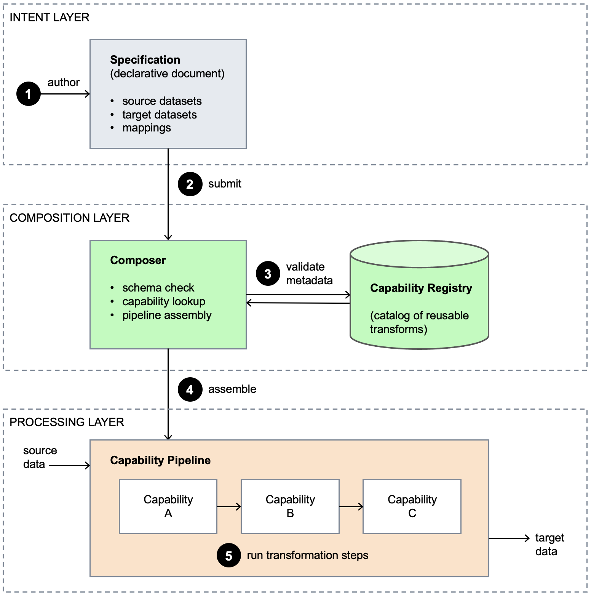

# Building Flexible Data Processing Workflows with Specification-Driven Composition on AWS

In modern enterprises, data comes from many sources—not just a single system—including databases, APIs, ERP systems, CRM platforms, and SaaS services. As integration requirements become more diverse, hard-coded workflows become a bottleneck. Every new data source or business process change requires developers to modify code, test, and redeploy the system.

To address this challenge, the AWS Architecture Blog introduces **Specification-Driven Composition**, an approach that builds data workflows from a specification rather than embedding workflow logic directly in code. This architecture makes workflows more flexible, easier to extend, and significantly reduces maintenance costs.

## The Challenge

Enterprise data systems often need to:

1. Retrieve data from multiple sources.
2. Apply multiple transformation steps.
3. Invoke multiple APIs or services.
4. Aggregate the results before returning them.

When workflow logic is hard-coded, every business change requires code updates, testing, and deployment, making it difficult for the system to adapt as the number of workflows and data sources grows.

## Core Idea

The proposed architecture uses a **specification** as the single source of truth for the workflow.

The specification defines:

1. The tasks to execute.
2. Input and output data.
3. Dependencies between tasks.
4. Conditions for continuing execution.
5. Tasks that can run in parallel.

The workflow engine simply reads the specification, builds an execution graph, and orchestrates the required tasks. As a result, business logic is no longer tightly coupled to the orchestration code.

## Architecture Components

The architecture consists of three primary groups of components:

- **Specification Repository** stores workflow definitions.
- **Workflow Engine** parses specifications and builds execution plans.
- **Task Executors** perform individual processing steps such as querying data, calling APIs, or transforming data.

Each task is an independent unit that can be reused across multiple workflows.

## Execution Flow

When a new request arrives:

1. The system identifies the appropriate specification.
2. The workflow engine reads the specification.
3. The engine analyzes task dependencies.
4. Independent tasks are executed in parallel whenever possible.
5. Task outputs are passed to downstream tasks.
6. After the workflow completes, the system aggregates the results and returns them to the application.

This enables workflows to be determined at runtime instead of being fixed in source code.

## Parallel Execution

A major advantage of this architecture is that the workflow engine can detect independent tasks and execute them simultaneously.

For example, if a report requires customer information, transaction history, and loyalty points from three different systems, the engine can send all three requests concurrently instead of sequentially, significantly reducing total execution time.

## Benefits

- **Flexibility:** Modify workflows by updating specifications instead of changing source code.
- **Scalability:** Easily add new tasks or data sources.
- **Reusability:** Reuse the same task across multiple workflows.
- **Performance:** Execute independent tasks in parallel.
- **Simplified Maintenance:** Business logic is clearly described in specifications, making it easier to understand and update.

## Use Cases

This architecture is particularly well suited for:

1. Enterprise data platforms.
2. ETL and ELT systems.
3. Applications integrating multiple APIs.
4. Data analytics platforms.
5. AI/ML workflows.

It is especially valuable for systems whose processing pipelines frequently evolve with changing business requirements.

## Conclusion

Instead of treating workflows as source code, treat them as data. By describing processes through specifications and allowing a workflow engine to execute them, organizations can build data processing systems that are more flexible, more scalable, and less dependent on source code changes whenever business requirements evolve.

**Original article:** https://aws.amazon.com/blogs/architecture/specification-driven-composition-for-flexible-data-workflows/

[Link](https://www.facebook.com/groups/awsstudygroupfcj/permalink/2211158986315728)

