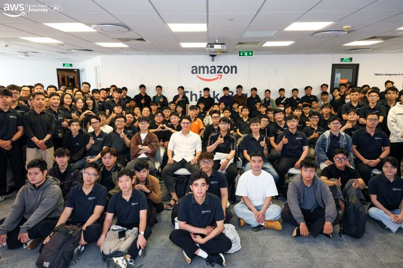
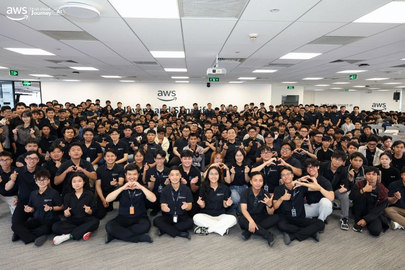
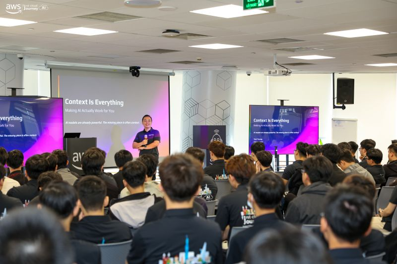

# Báo cáo tóm tắt: “FCAJ Community Day”

### Mục tiêu sự kiện

- Chia sẻ các phương pháp hay (best practices) về Amazon CloudFront
- Cách xây dựng Hệ thống Multi-Agent cấp doanh nghiệp (Enterprise-Grade Multi-Agent System)
- Khám phá cách LLM thực sự hoạt động

### Diễn giả

- **Tinh Truong** – Platform Engineer, GoTymeX
- **Pham Nguyen Hai Anh** – AWS Community Builder, G-AsiaPacific Vietnam
- **Nguyen Tuan Thinh** – DevOps Engineer, First Cloud AI Journey
- **Duc Dao** – Solution Architect, Cloud Kinetics
- **Vy Lam** – Senior Business Systems Analyst, VPBank
- **Team VIB** – UTMorpho

### Những điểm nổi bật

### Context Is Everything: Giúp AI thực sự làm việc cho bạn
#### Những điểm chính

- Các mô hình AI rất mạnh mẽ. Vấn đề thường nằm ở ngữ cảnh chưa đủ tốt.
- Ngữ cảnh tốt hơn sẽ mang lại kết quả AI tốt hơn.
- Context Engineering đang trở thành một kỹ năng cốt lõi trong tương lai.
- Context không phải là thông tin bổ sung. Context chính là trải nghiệm của sản phẩm.

### FROM EDGE TO ORIGIN: CloudFront là nền tảng của bạn
#### Những điểm chính

- Tối ưu hóa chi phí với Amazon CloudFront.
- Nâng cao độ tin cậy với Amazon CloudFront.
- Cải thiện hiệu năng với Amazon CloudFront.

### Tính không xác định của các thiết lập LLM "mang tính xác định"
#### Những điểm chính

- Tính không xác định liên quan đến kiến trúc GPU, độ chính xác số thực (floating-point) và tối ưu hóa suy luận (inference optimization).
- `temp=0` loại bỏ tính ngẫu nhiên do lấy mẫu (sampling), nhưng không loại bỏ tất cả các nguồn gây ra tính không xác định.
- Hãy thử đặt `temp=0.1` nếu gặp hiện tượng phản hồi lặp.
- Hãy nhớ đọc tài liệu (Read the Docs).
- Xây dựng hệ thống với sự biến thiên (variance) trong tâm trí.
- Chạy nhiều lần và sử dụng Ensembles (đánh đổi giữa chi phí và độ chính xác).
- Áp đặt đầu ra có cấu trúc bằng các tham số, không chỉ bằng prompt.
- Thiết kế hệ thống để xử lý bản chất xác suất (probabilistic).

### Hệ thống Multi-Agent cấp doanh nghiệp
#### Những điểm chính

- Hệ thống Multi-Agent cung cấp chuyên môn hóa và khả năng kiểm toán mà hệ thống Single-Agent không thể đáp ứng.
- Bảo mật, tuân thủ và vận hành phải được xem xét ngay từ ngày đầu tiên, không phải bổ sung sau.
- Bedrock AgentCore, ECR và API Gateway cung cấp hạ tầng sẵn sàng cho môi trường production.
- Giảm hơn 90% chi phí và tăng tốc xử lý lên 95% — giá trị kinh doanh là rất rõ ràng.

#### Học hỏi từ các diễn giả có chuyên môn cao

- Các chuyên gia từ AWS và các tổ chức công nghệ lớn đã chia sẻ các **phương pháp hay (best practices)** trong thiết kế ứng dụng hiện đại.

#### Kết nối và thảo luận

- Workshop mang đến cơ hội trao đổi ý tưởng với các chuyên gia, đồng nghiệp và đội ngũ kinh doanh, góp phần xây dựng **ngôn ngữ chung (ubiquitous language)** giữa business và công nghệ.

#### Những bài học rút ra

- Các mô hình AI rất mạnh mẽ, nhưng vấn đề thường là ngữ cảnh chưa đủ tốt. Ngữ cảnh tốt hơn sẽ mang lại kết quả AI tốt hơn.
- Học được cách tối ưu đầu ra của LLM.
- Hệ thống Multi-Agent cung cấp chuyên môn hóa và khả năng kiểm toán mà Single-Agent không thể đáp ứng.
- Học được cách xây dựng hệ thống một cách đáng tin cậy, an toàn và có khả năng mở rộng.

#### Một số hình ảnh tại sự kiện

