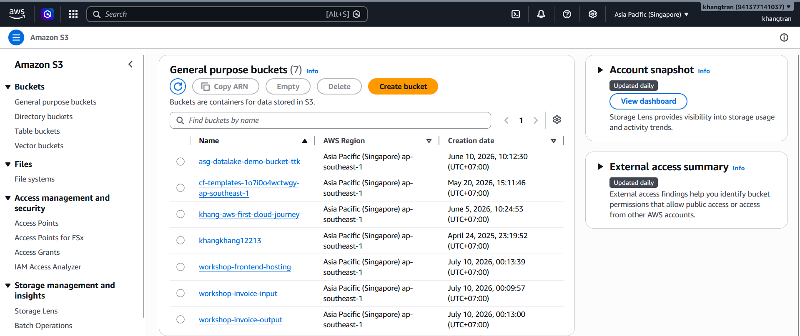
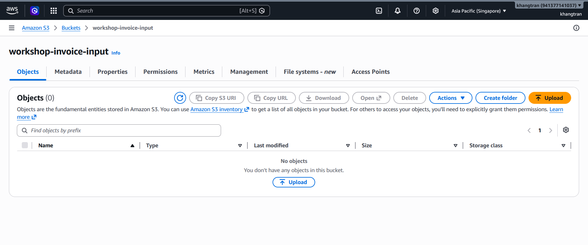
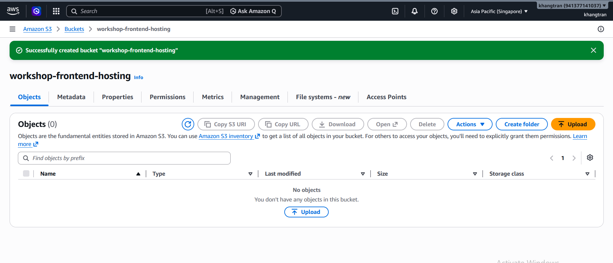

1. Open the [Amazon S3 console](https://ap-southeast-1.console.aws.amazon.com/s3/home?region=ap-southeast-1#)
2. On the main page, click **Create bucket** to create the first bucket:

3. In the **Create bucket** page:
+ Set the bucket name to **workshop-invoice-input** (Stores the original PDF files)
+ Block all public access
+ Keep the default configuration
+ Click **Create bucket** 

4. Create the second bucket: 
+ Return to the home page and choose **Create bucket**
+ Set the bucket name to **workshop-invoice-output** (Stores the JSON output generated by BDA)
+ Block all public access
+ Keep the default configuration
+ Click **Create bucket**

5. Create the third bucket: 
+ Return to the home page and choose **Create bucket**
+ Set the bucket name to **workshop-frontend-hosting** (Stores the web frontend source code)
+ Block all public access
+ Keep the default configuration
+ Click **Create bucket**

