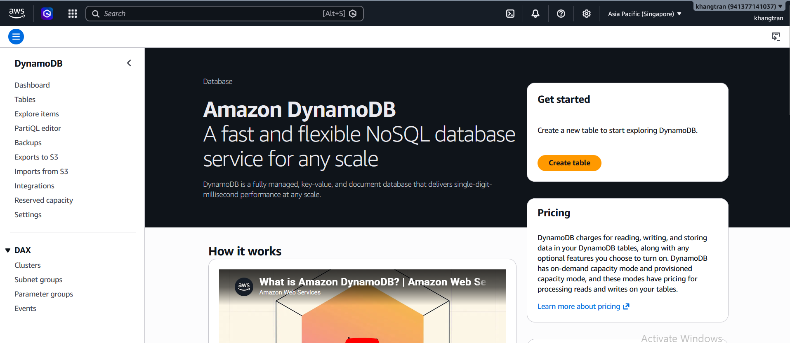
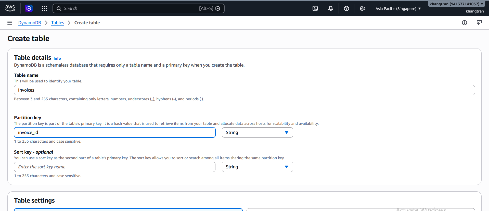
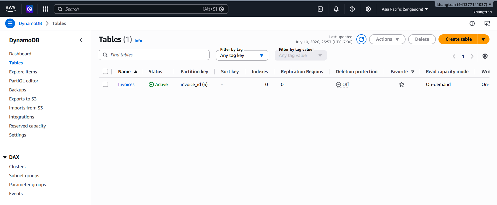

#### Tạo bảng Invoices

1. Vào DynamoDB Console, tạo bảng để lưu dữ liệu đã chuẩn hóa

2. Trong console, chọn **Create table**

3. Trong Create table console
+ Đặt tên table: Invoices 
+ Partition key : invoice_id (String)

+ Giữ nguyên giá trị của các fields khác (default)
+ Kéo chuột xuống và chọn **Create table**
+ Tạo thành công bảng Invoices

#### Tóm tắt

Chúc mừng bạn đã hoàn thành. Trong phần này, bạn đã tạo 3 buckets trong Amazon S3 và 1 bảng dữ liệu trong DynamoDB.Đây là lớp nền tảng của ứng dụng giúp chúng ta có thể lưu trữ dữ liệu hóa đơn để xử lý và sau khi xử lý cũng như tài nguyên tĩnh của website.