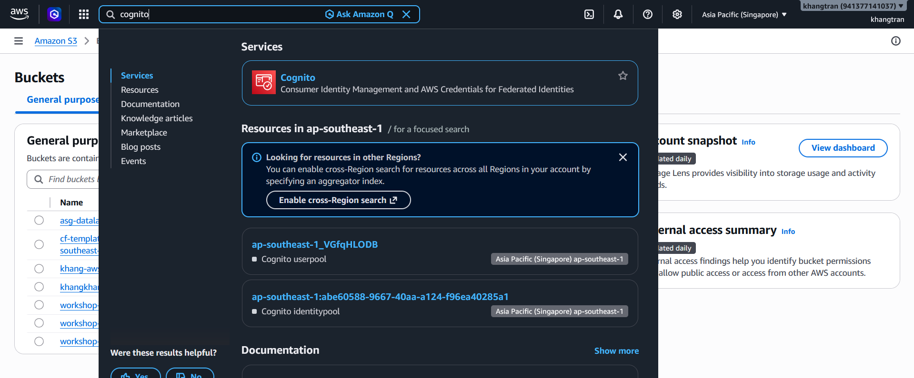
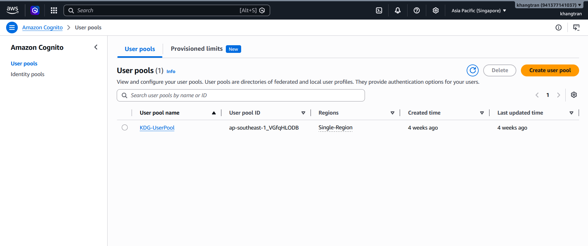
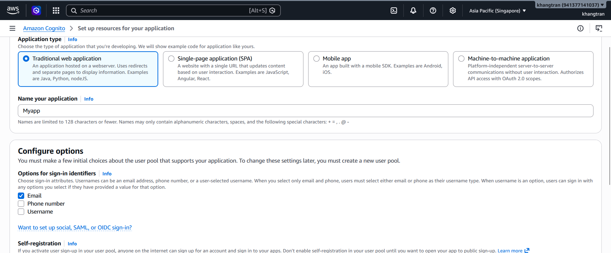
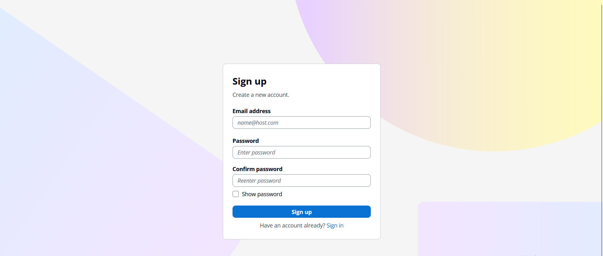
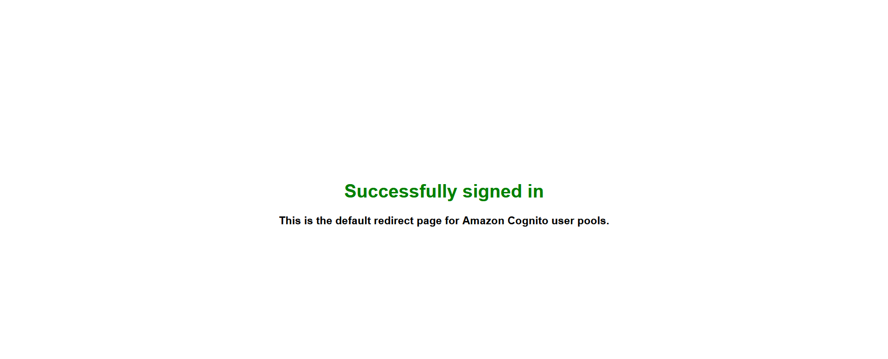

#### Cấu hình Amazon Cognito
1. Truy cập [Amazon Cognito Console](https://ap-southeast-1.console.aws.amazon.com/cognito/v2/home?region=ap-southeast-1#)

2. Trong trang chính,chọn **Create User Pool**

+ Tạo một User Pool,đặt tên **MyApp**
+ Cấu hình đăng nhập bằng Email/Password.

+ Chọn **Create User Pool**
3. click vào URL Cognito tạo ra cho chúng ta khi tạo thành công để tạo một **App Client**
+ Tạo một test user để lát nữa đăng nhập.
+ Nhập email,mật khẩu
+ Chọn **Sign up**  

+ Sau khi đăng ký thành công sẽ có thông báo như màn hình như hình và email thông báo 

