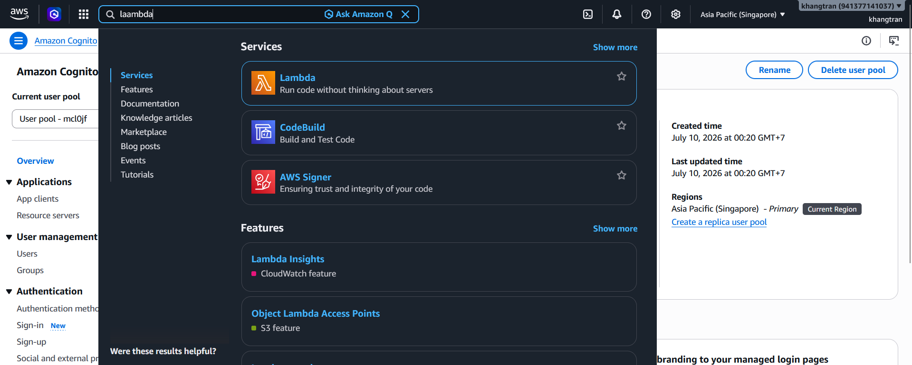
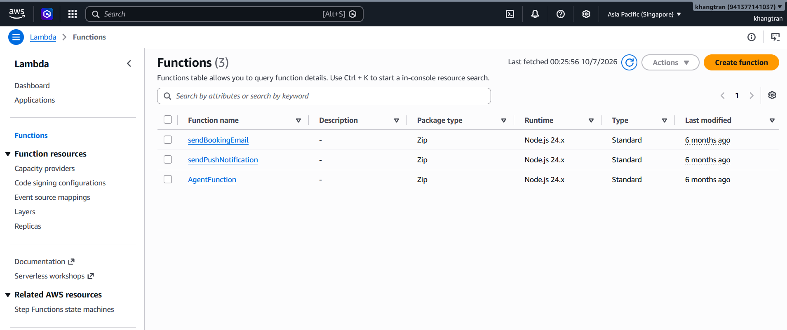
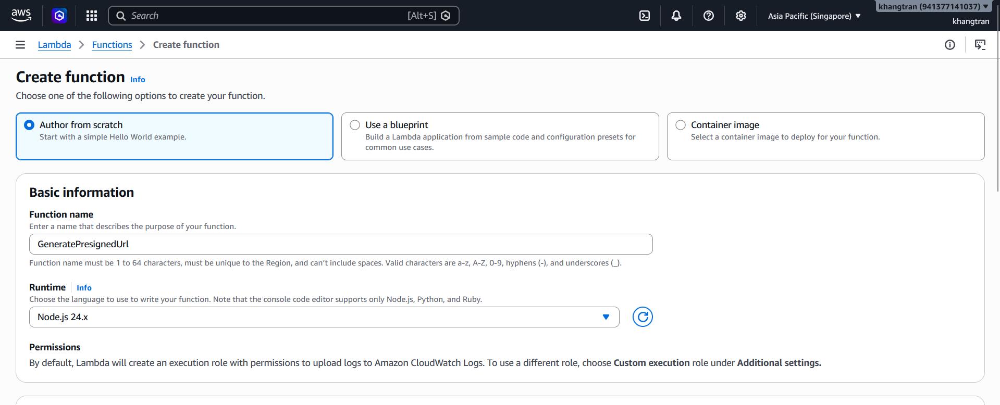
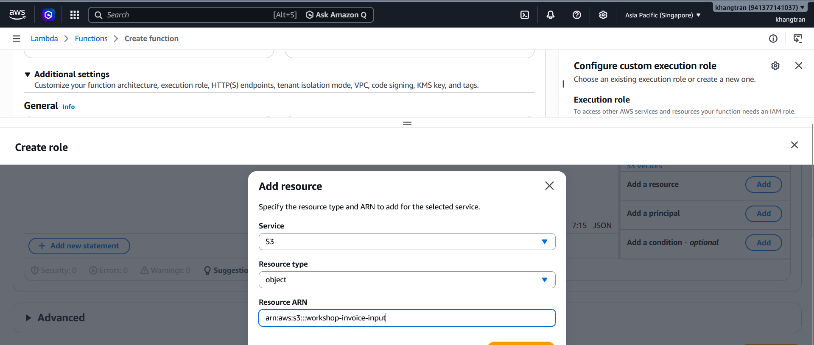
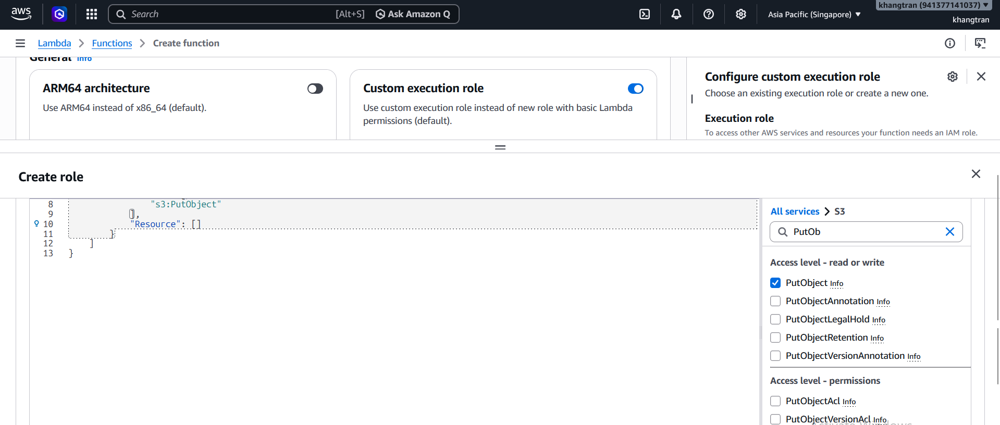
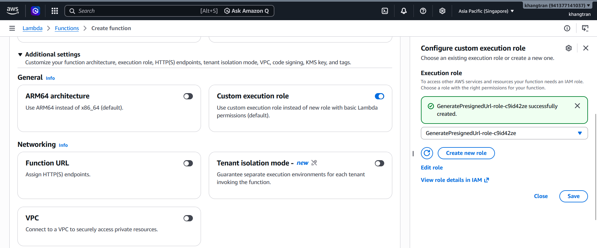

Trong phần này, bạn sẽ tạo 1 hàm trong Lambda sinh ra một URL upload tạm thời có hiệu lực trong 5 phút trả về cho Frontend.

1. Vào [Lambda console](https://ap-southeast-1.console.aws.amazon.com/lambda/home?region=ap-southeast-1#)

+ Trong lambda console ,chọn **Create Function**

2. Trong Create function console:
+ Đặt tên function **GeneratePresignedUrl**
+ **Runtime NodeJs** 

3. Kéo xuống trong phần Additional Setting.Enable **Custom Execution Role** rồi chọn **Create role**,sau đó chọn **Add a resource** 
+ Service : S3
+ Resource type : object
+ Resource ARN : copy ARN từ bucket **invoice_input** trong S3

4. Gán quyền (IAM Role) cho Lambda này: tìm **s3:PutObject**

+ Chọn **Create Role**
+ Tạo role thành công 

5. Chọn **Save**
6. Chọn **Create Function** để tạo hàm
