1. Open [API Gateway console](https://ap-southeast-1.console.aws.amazon.com/apigateway/main/apis?region=ap-southeast-1).
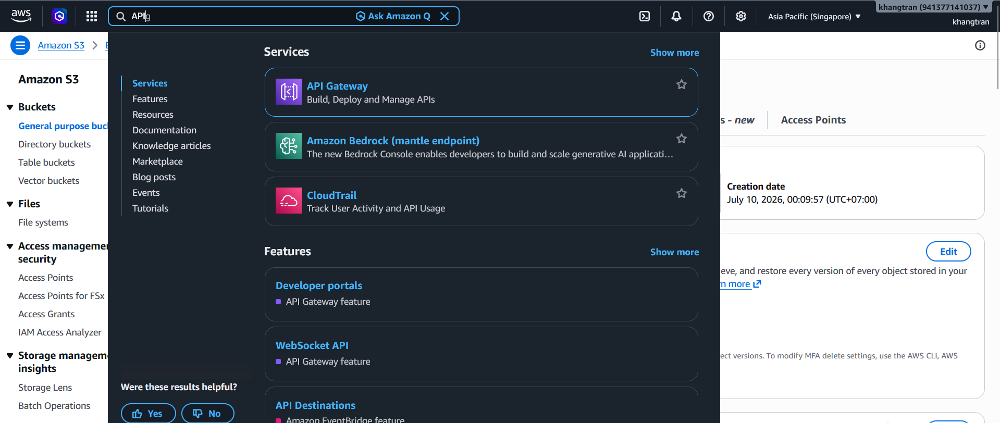

2. In the API Gateway console, choose **Create API**
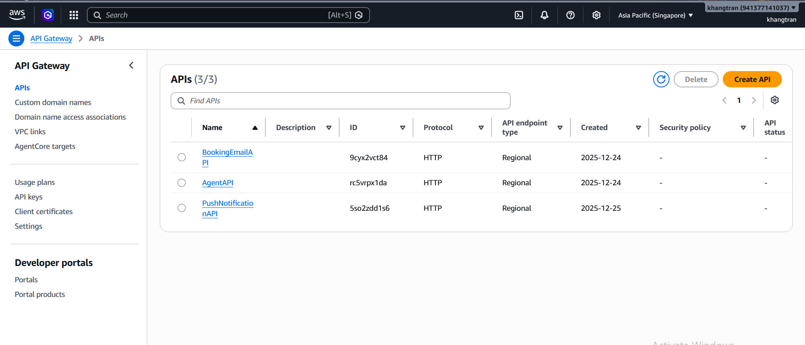
3. In the **Create API** page, choose **Build** to create an **HTTP API** 
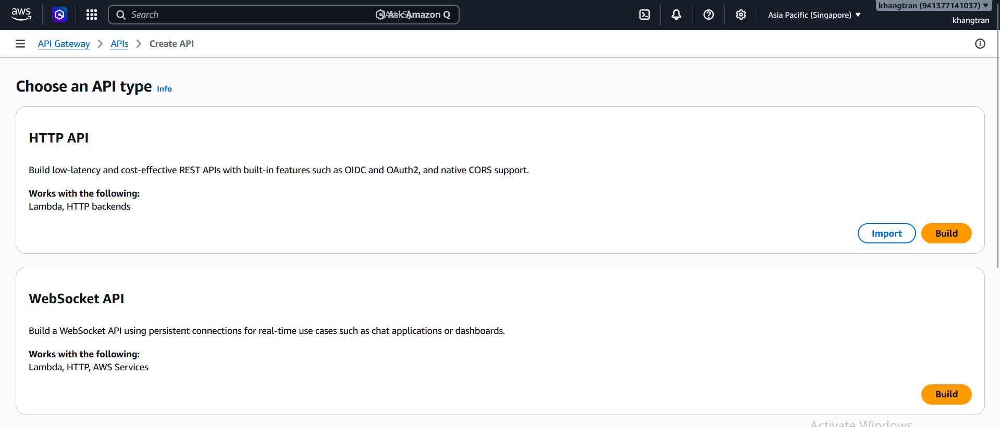
4. In **API details** 
+ Set the API name to: **WorkshopAPI**
+ For **Integrations**, choose **Lambda** 
+ AWS Region: **ap-southeast-1**
+ Lambda function: Copy the ARN of the **GeneratePresignedUrl** function you created earlier to integrate with API Gateway.
+ Choose **Next**
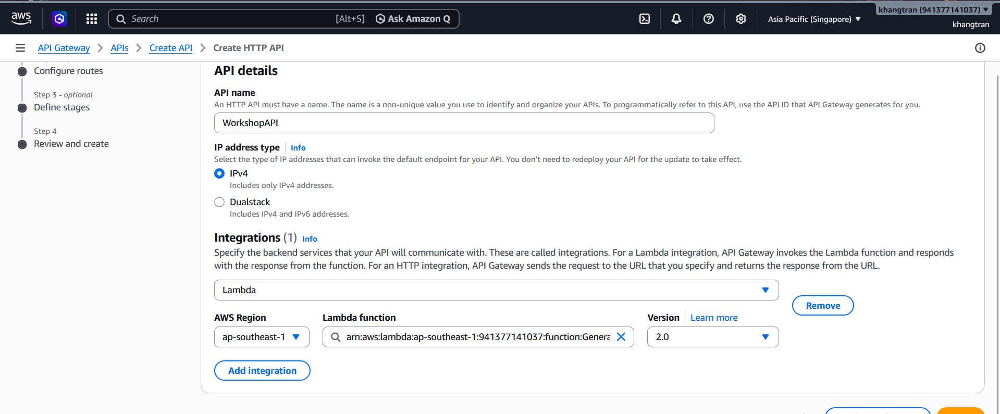
5. In **Configure Routes**
+ Method: **GET**
+ Resource path: **/upload-url**
+ Integration target: **GeneratePresignedURL** Lambda function
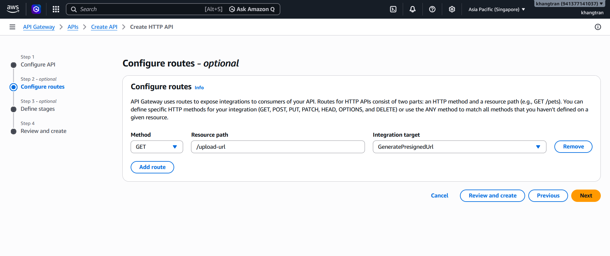
6. Keep the default settings for **defined stages**. In **Review and Create**, review your configuration, then choose **Create**.
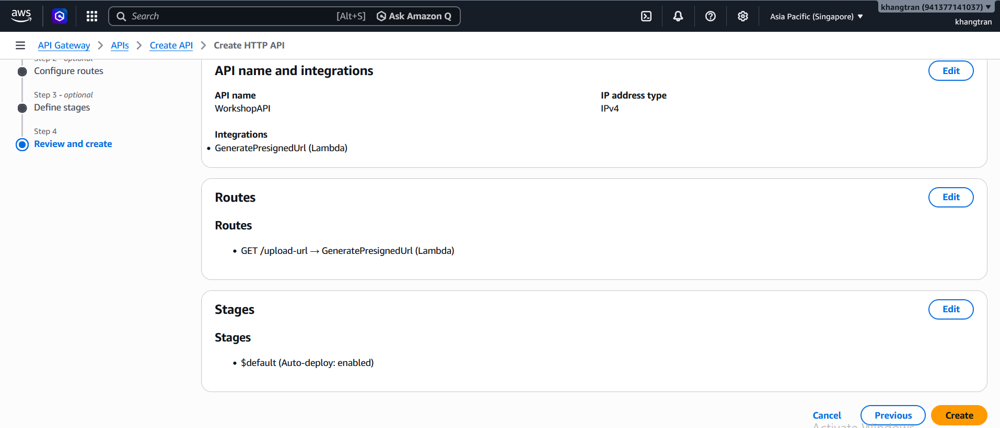
7. Open the dashboard and choose **Authorization**
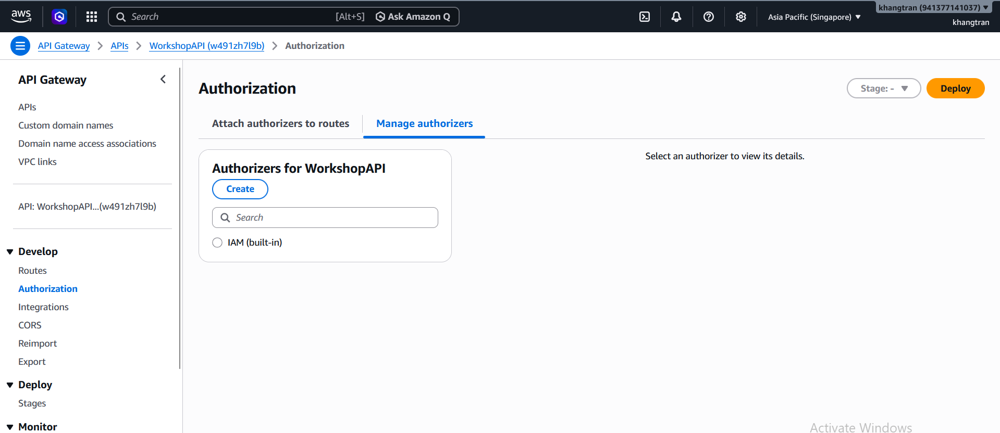
+ Under **Manage authorizers**, choose **Create**
8. In the **Create authorizer** page
+ Authorizer type: **JWT**
+ Name: **MyAppAuthorizer**
+ For **Issuer URL**, open Amazon Cognito and select the user pool created in the previous section.
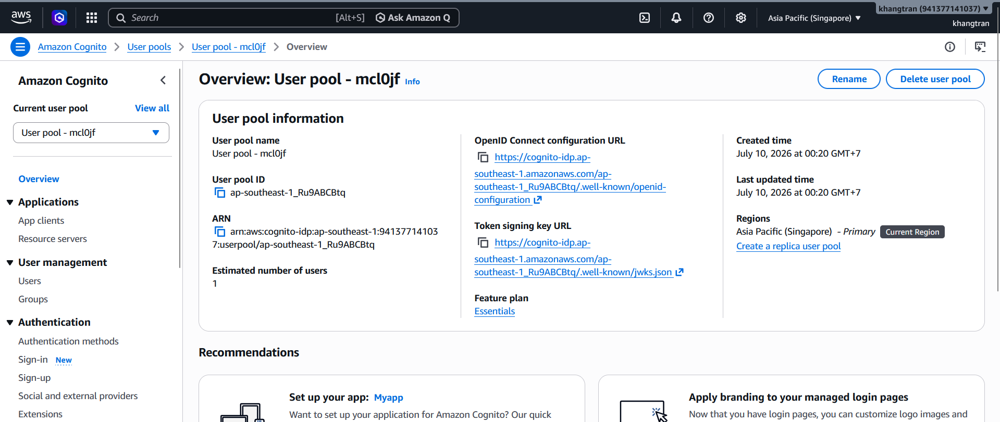
+ Copy the **Token signing key URL** and paste it into the **Issuer URL** field.
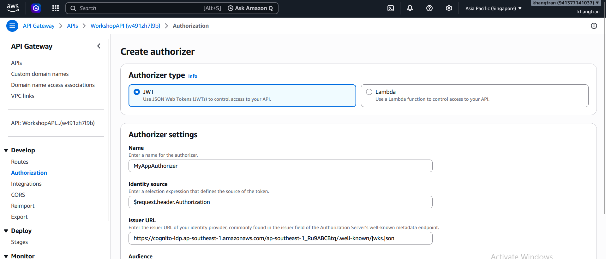
+ Choose **Create**
9. Open the dashboard and go to **Routes** to attach the authorizer to the **/upload-url** route.
+ Choose **Attach Authorization**
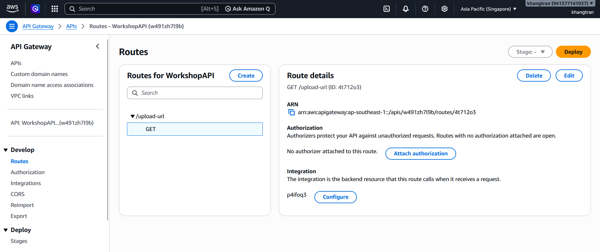
+ In the **Attach Authorization** page, select **MyAppAuthorizer**, then choose **Attach authorizer**.
+ Choose **Save**
10. Next, integrate this route to trigger the **GeneratePresignedUrl** Lambda function.
+ Open the Lambda console and select the **GeneratePresignedURL** function.
+ Choose **Configuration → Triggers**, then select **API Gateway**.
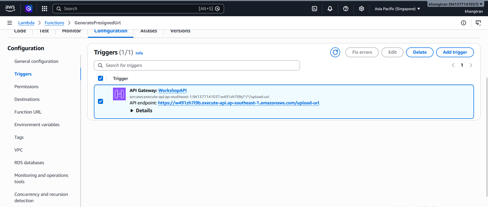
+ Scroll to the **Security** section and select **MyAppAuthorizer** as the authorizer.
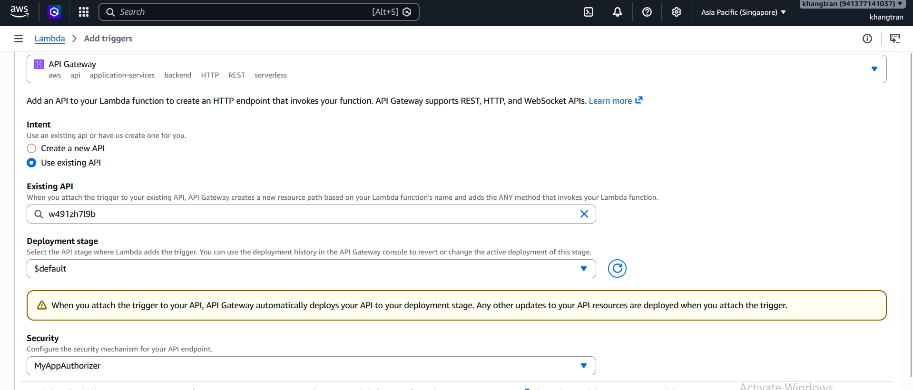

Current workflow: User signs in to the frontend → obtains a token → calls API Gateway (including the token) → Lambda returns an Amazon S3 presigned URL → the user uploads the file directly to Amazon S3 using that URL.

