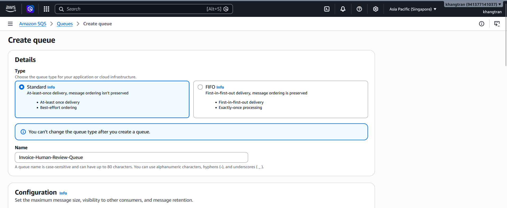
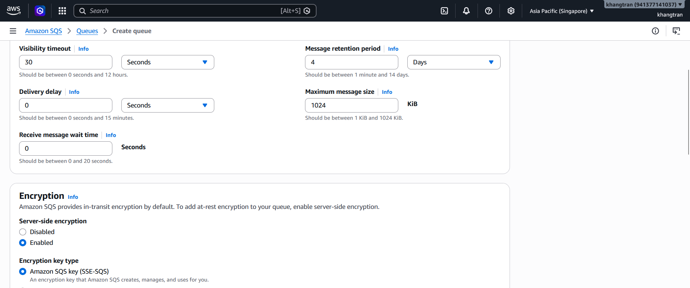
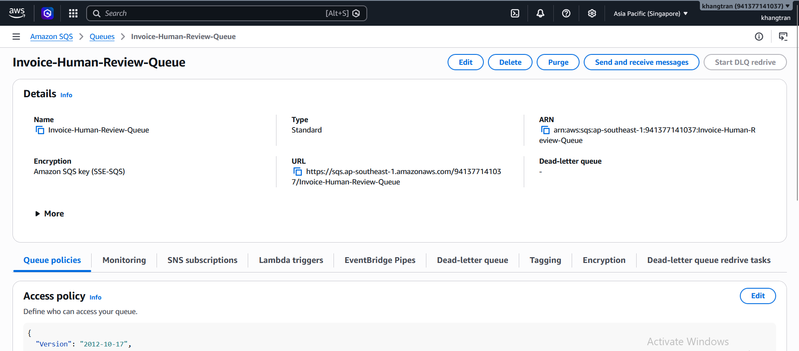

Trong phần này, bạn sẽ tạo 1 hàng đợi SQS(Human Review Queue) dùng để admin review lại các hóa đơn có confidence score < 0.9.

Truy cập [SQS console](https://ap-southeast-1.console.aws.amazon.com/sqs/v3/home?region=ap-southeast-1#/queues)

1. Trong console,chọn **Create Queue**
2. Trong Create Queue console
+ Chọn Type : **Standard**
+ Dặt tên : **Invoice-Human-Review-Queue**
+ Phần config còn lại giữ nguyên

3. Chọn **Create queue**

+ Giao diện sau khi tạo queue thành công như ảnh

