#### Xây dựng State Machine (Step Functions)
1. Vào **Step Functions**, tạo một State Machine mới với luồng đi như sau:
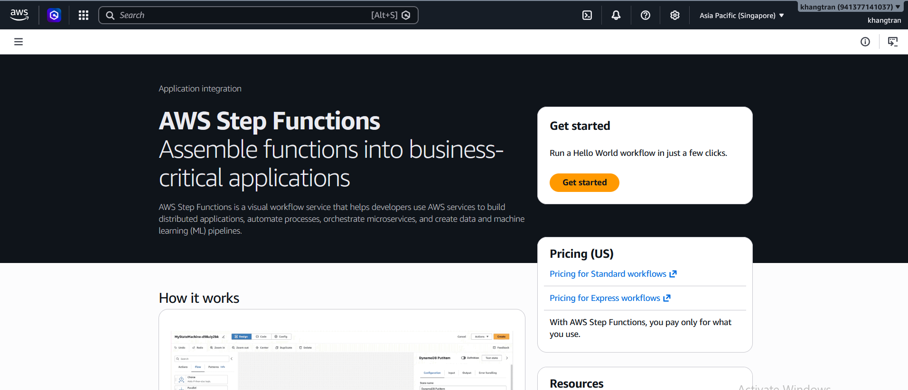

+ Task 1 (Call BDA): Gọi API bedrock-data-automation:InvokeDataAutomationAsync truyền vào URI của file PDF vừa lên S3 (từ Event đầu vào) và ID của Blueprint đã tạo ở Giai đoạn 3. Cấu hình output ghi ra bucket **workshop-invoice-output**.
+ Task 2 (Wait/Check Status): Loop kiểm tra xem BDA đã xử lý xong chưa (vì đây là hàm async).
+ Task 3 (Invoke Lambda): Gọi Lambda ProcessInvoiceData vừa tạo ở trên.
+ Choice State: (dùng Choice của Step Function để quyết định hướng đi rẽ nhánh sang DynamoDB hoặc SQS trực quan trên biểu đồ).
+ Lưu ý: Phải cấp quyền IAM cho Step Functions Role được phép gọi Bedrock, S3, và Lambda.

Chúng ta sẽ import code thay vì thiết kế bằng tay,code nằm trong **link github** ở phần **Tham khảo**
2. sau khi import code chúng ta sẽ có diagram như sau
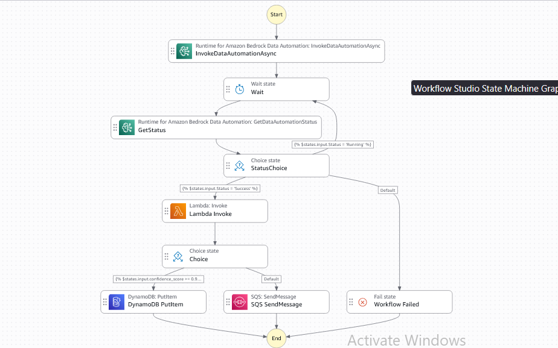
3. Qua mục **Config**
+ Đặt tên cho workshop
+ Chọn **Type Standard**
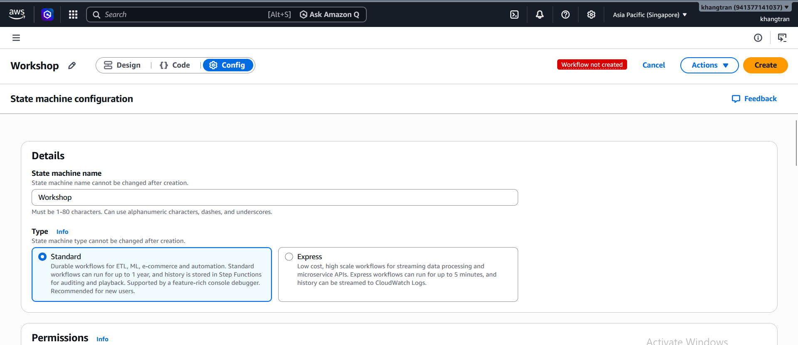
4. Kéo xuống phần **Logging**
+ chọn **ALL**,một nhóm CloudWatch Logs sẽ được tạo để lưu log của state machine
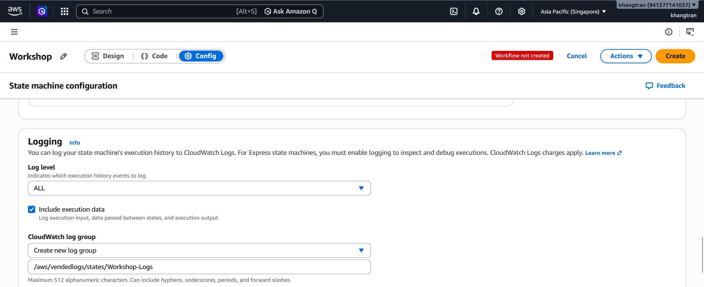
5. Sau đó chọn **Create**
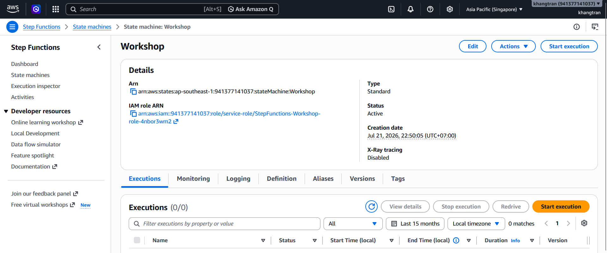

## Kết nối bằng EventBridge
1. Vào Amazon EventBridge -> Rules -> Create Rule.
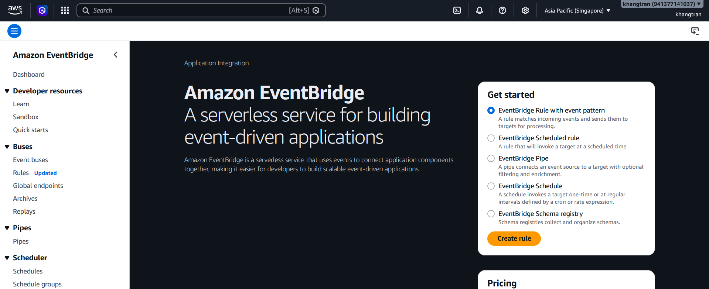
+ Chọn Event pattern:
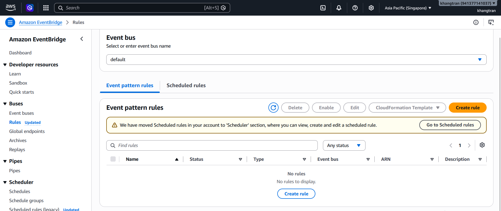
+ Service: **S3**
+ Event Type: **Object Created**
+ Specific bucket: **workshop-invoice-input**
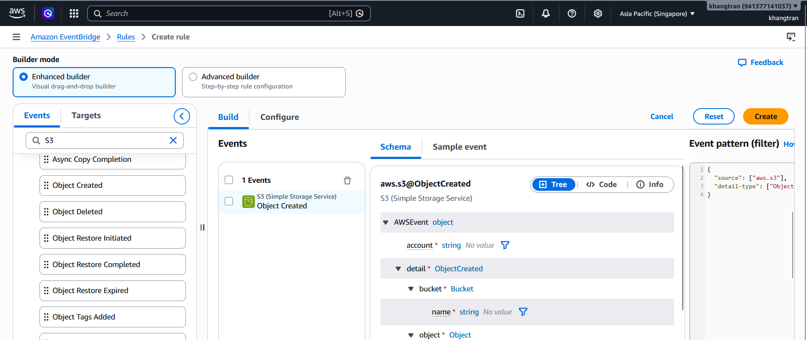
+ Target: Chọn Step Functions State Machine vừa tạo
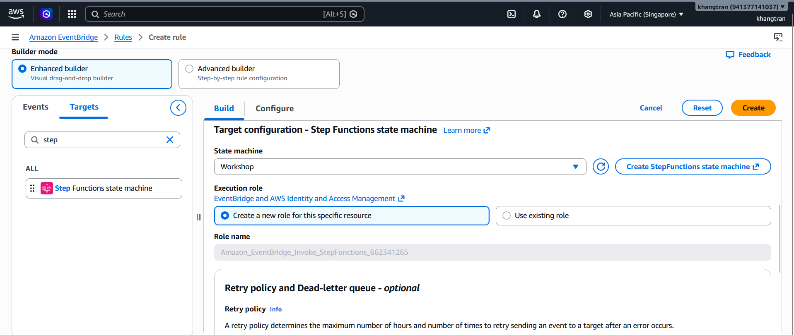
2. Phần **Configure**.
+ Đặt tên rule : **TriggerRule**
+ Còn lại giữ nguyên
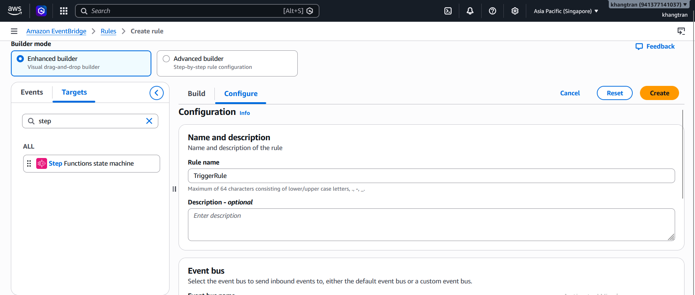
3. Chọn **Create**
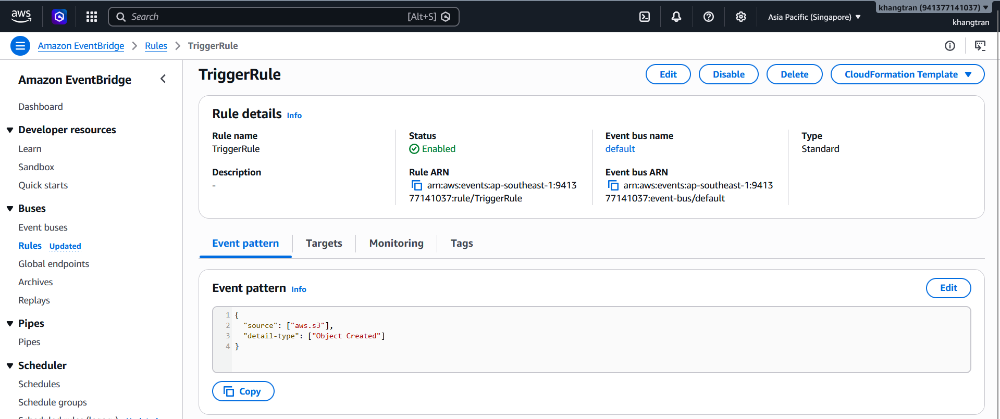

