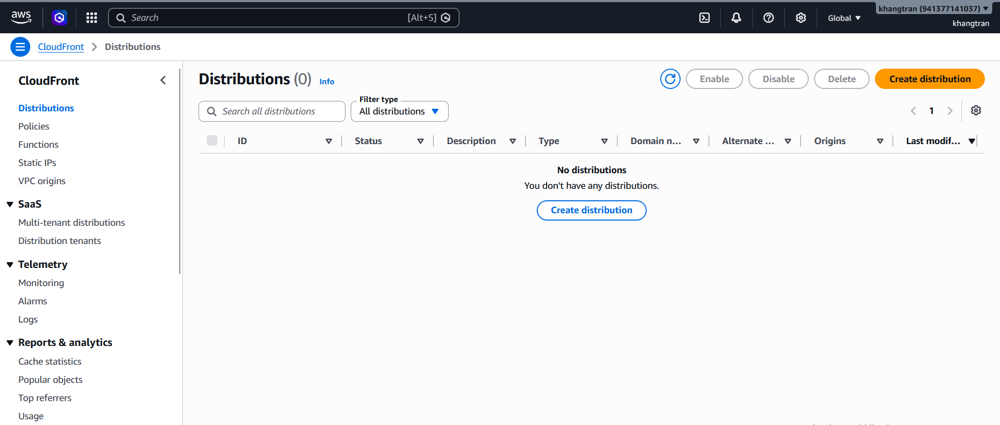
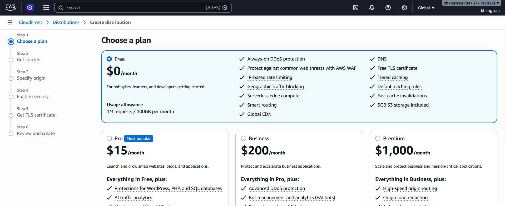
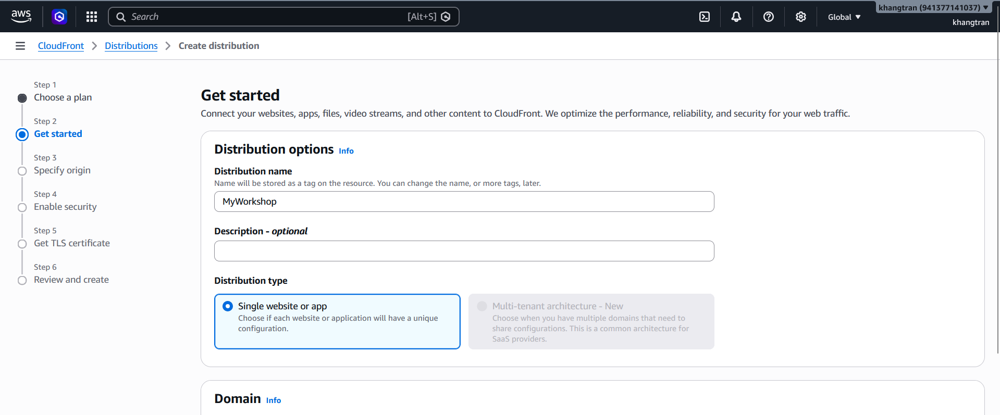
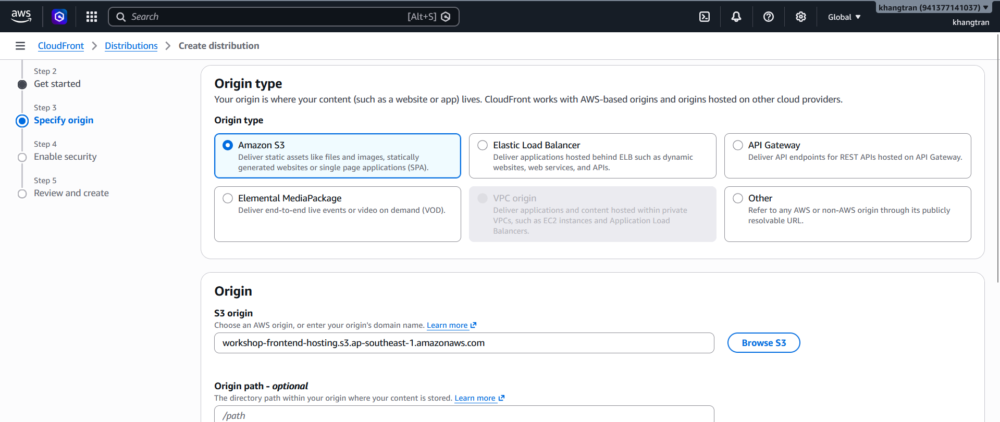
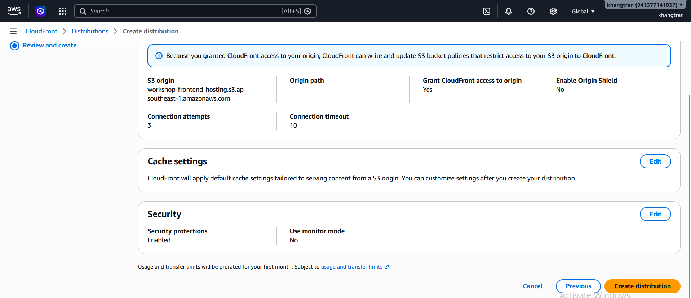
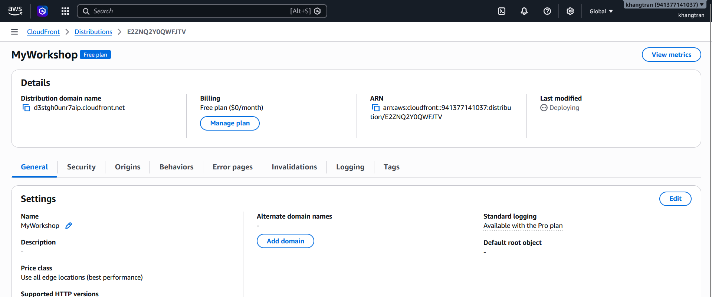
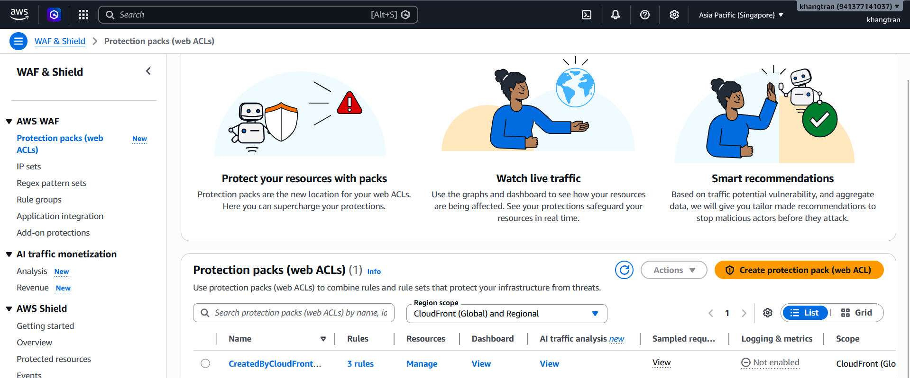

1. Truy cập [CloudFront console](https://us-east-1.console.aws.amazon.com/cloudfront/v4/home?region=ap-southeast-1)

2. Trong console,chọn **Create distribution**

+ Mục Choose a plan chọn **Free**

+ Mục Get Started, đặt tên cho Distribution : **MyWorkshop**
+ Distribution type : **Single website or app**

+ Mục Specify Origin,chọn Origin trỏ về S3 Frontend bucket.
+ S3 origin ,chọn **Browse S3** và tìm bucket **Workshop-frontend-hosting**

+ Mục Enable security, chúng ta có WAf là mặc định nên chọn **Next**,không cấu hình gì thêm
+ Cuối cùng ở Review & Create chúng ta kiểm tra lại những gì đã cấu hình và chọn **Create distribution**

3. Truy cập vào [WAF console](https://ap-southeast-1.console.aws.amazon.com/wafv2-pro/home?region=ap-southeast-1)
+ Chúng ta Cloudfront đã tạo cho chúng web ACL,web ACL này dùng để bảo vệ CLoudfront với các rule bảo vệ cơ bản: AWS Managed Rules (Core rule set, SQLi, IP Reputation).

